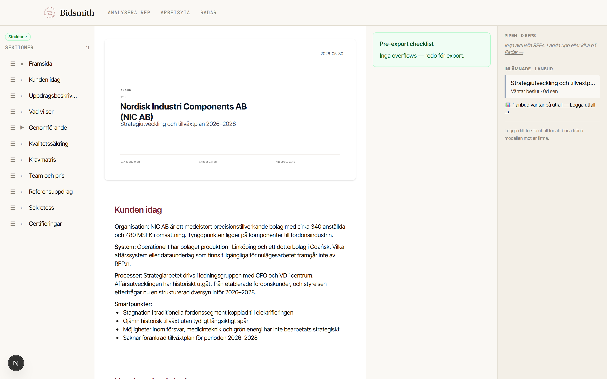
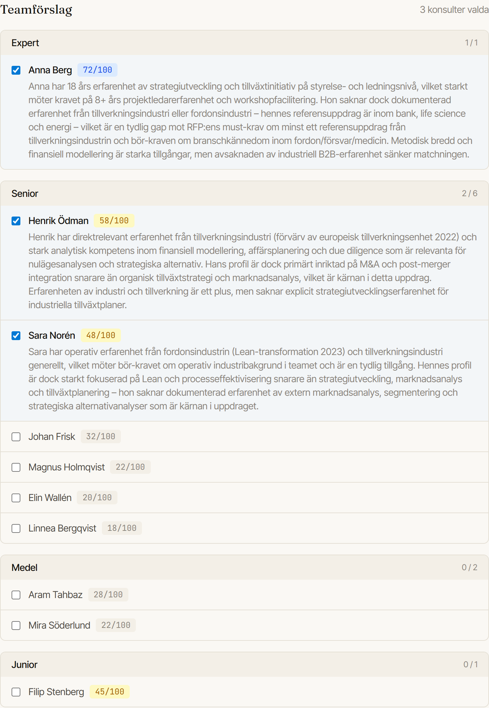
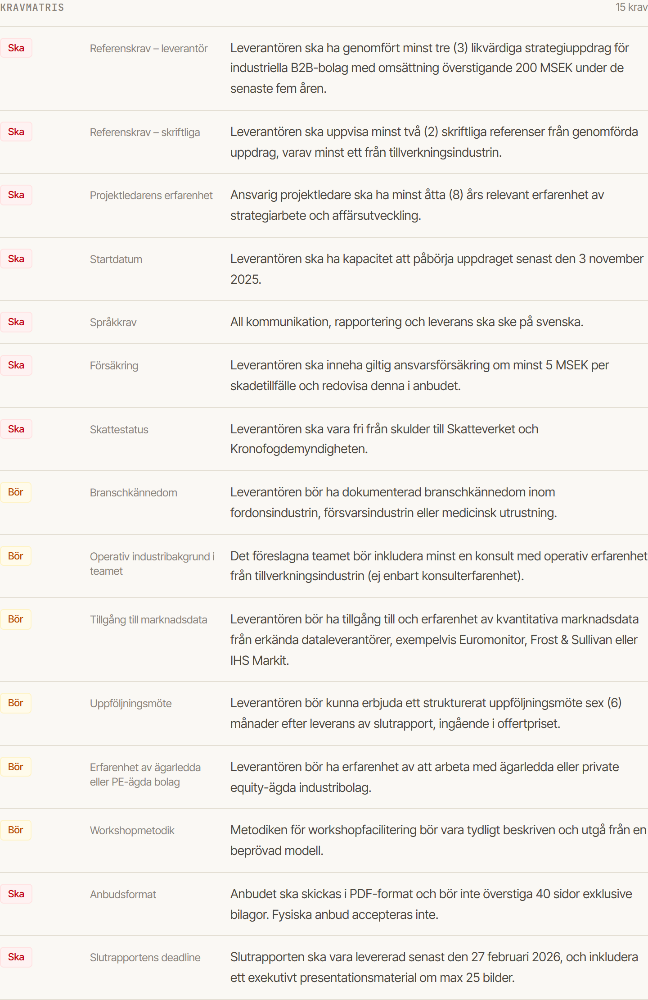

<h1>
  
  &nbsp;Bidsmith
</h1>

**From a public tender to a first-draft proposal — forged in minutes, finished by a senior consultant.**

[](LICENSE)


<p align="center">
  
</p>

Bidsmith is an AI agent for consulting firms that turns a request for proposal (RFP)
plus your consultant profiles into a structured, editable bid draft. It does the
mechanical heavy lifting — reading the tender, matching the right consultants,
assessing whether the bid is worth pursuing, and drafting the proposal — so a senior
consultant can spend their time on judgement and polish instead of a blank page.

Built for mid-sized management and IT consultancies (≈20–100 consultants).

> Bidsmith started as a personal side project. It is released as open source so others
> can use it, learn from it, and build on it. The author retains credit; the work is
> free to use under the Apache 2.0 license.

---

## What it does

Bidsmith puts a tender on the anvil and works it through a sequence of focused AI
steps. Each step receives the *compressed output* of the previous one — not the raw
documents — which keeps prompts tight and cost predictable.

1. **Requirement analysis** — parses the RFP and extracts structured requirements.
2. **Consultant matching** — ranks your consultant pool against those requirements.
3. **Go / No-Go** — estimates win probability and recommends whether to bid.
4. **Bid generation** — drafts the full proposal (understanding, approach, phases,
   team, quality assurance, references, certifications) into a PowerPoint template.
5. **RFP radar** — surfaces relevant new public tenders (TED) on a schedule.

A built-in **bid editor** lets the consultant edit every section inline, with overflow
checks against the template's layout budget so the exported deck stays clean.

<table>
<tr>
<td width="50%"></td>
<td width="50%"></td>
</tr>
<tr>
<td align="center"><sub><b>Consultant matching</b> — your pool ranked against the tender, with a per-fit score and rationale</sub></td>
<td align="center"><sub><b>Requirement matrix</b> — must / should requirements extracted straight from the RFP</sub></td>
</tr>
</table>

## How it's built

- **Model strategy** — Claude Sonnet for extraction and matching (mechanical,
  JSON-structuring work), Claude Opus for proposal writing (where the bid is won or
  lost), Haiku as a future pre-filter for large consultant pools.
- **Quality** — an offline evaluation harness scores generated bids on structure,
  coverage, and hallucination, with synthetic fixtures included so you can run it
  out of the box.
- **Layout fidelity** — a three-layer corrector (prompt-level character budgets →
  post-generation verification with retry → flag-only review in the editor) keeps the
  PowerPoint output close to the source template.

## Tech stack

Next.js 16 (App Router) · TypeScript · Tailwind v4 · Supabase (PostgreSQL + Storage) ·
[pptx-automizer](https://github.com/singerla/pptx-automizer) for PowerPoint rendering ·
Claude API · Vercel.

## Getting started

**See [SETUP.md](SETUP.md) for the full 10-minute guide** — Supabase project, database
schema, storage bucket, environment variables, and email login, step by step.

The short version:

```bash
npm install
cp .env.local.example .env.local   # fill in your keys (see SETUP.md)
# → run supabase/migrations/001_initial_schema.sql in the Supabase SQL Editor
# → create a private storage bucket named "rfp-documents"
npm run dev                         # → http://localhost:3000
```

### Running the evaluators

```bash
npm run eval:analyzer        # requirement-analysis quality
npm run eval:matcher         # consultant-matching quality
npm run eval:bid-generator   # bid quality: structure / coverage / hallucination
```

Synthetic fixtures live in `evals/fixtures/` and sample data in `data/synthetic/`, so
the project is runnable without any real tender data.

## Project layout

```
src/lib/ai-client.ts        Centralised Claude calls (retry + JSON extraction)
src/lib/ai-schemas.ts       Zod schemas validating every AI response
src/lib/document-parser.ts  Document parsing (markitdown-js)
src/lib/bid-generator/      Proposal generation: parallel AI calls + bundles
src/lib/pptx-template/      PowerPoint template engine + layout corrector
src/lib/eval/               Runtime evaluation (structure judge)
evals/                      Offline evaluation harness
supabase/migrations/        Database schema
docs/architecture.html      Architecture overview
```

## Contributing

Bidsmith is open source and contributions are welcome. Open an issue to discuss a
change, or send a pull request against `main`. Keep changes focused, match the existing
style, and run the evaluators before submitting.

## A note on data

Bidsmith never sends raw documents between pipeline steps — only compressed,
structured output. Real tender and consultant data stays in your own Supabase
instance. The public repository ships only synthetic sample data.

## License

[Apache License 2.0](LICENSE) © 2026 Stefan Edgren.

You are free to use, modify, and distribute Bidsmith, including commercially, provided
you retain the copyright and license notices. See [LICENSE](LICENSE) and [NOTICE](NOTICE).
