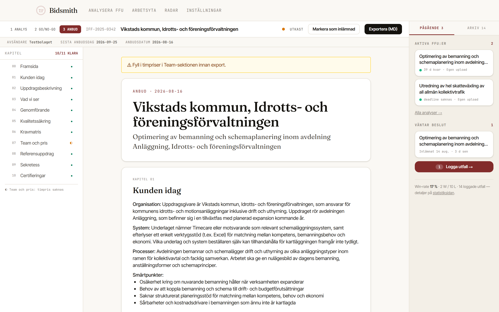
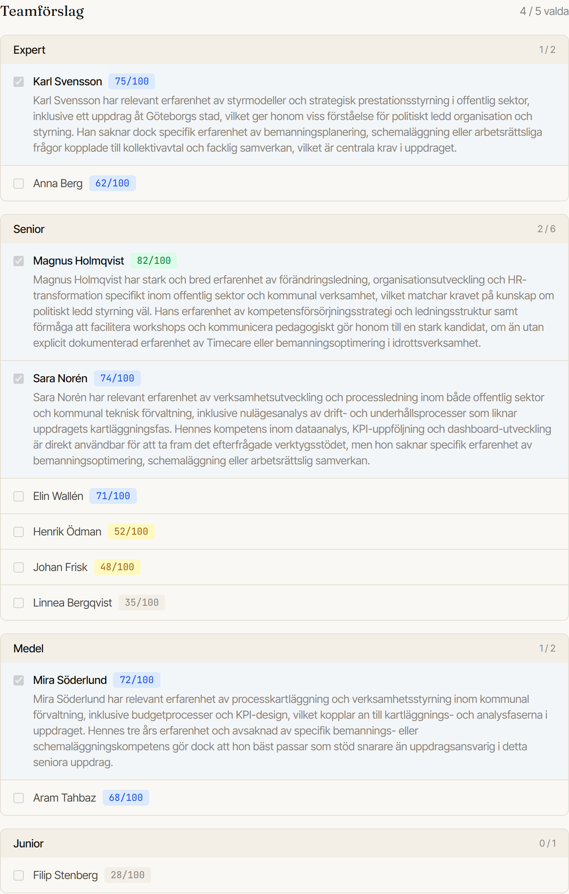
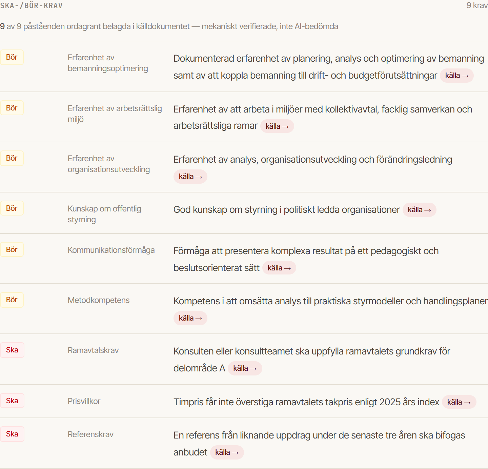

<h1>
  
  &nbsp;Bidsmith
</h1>

**From a public tender to a first-draft proposal — forged in minutes, finished by a senior consultant.**

[](LICENSE)


<p align="center">
  
</p>

Bidsmith is an AI agent for consulting firms that turns a request for proposal (RFP)
plus your consultant profiles into a structured, editable bid draft. It does the
mechanical heavy lifting — reading the tender, matching the right consultants,
assessing whether the bid is worth pursuing, and drafting the proposal — so a senior
consultant can spend their time on judgement and polish instead of a blank page.

Built for mid-sized management and IT consultancies (≈20–100 consultants).

> Bidsmith started as a personal side project. It is released as open source so others
> can use it, learn from it, and build on it. The author retains credit; the work is
> free to use under the Apache 2.0 license.

---

## What it does

Bidsmith puts a tender on the anvil and works it through a sequence of focused AI
steps. Each step receives the *compressed output* of the previous one — not the raw
documents — which keeps prompts tight and cost predictable.

1. **Requirement analysis** — parses the RFP and extracts structured requirements.
2. **Consultant matching** — ranks your consultant pool against those requirements.
3. **Go / No-Go** — estimates win probability and recommends whether to bid.
4. **Bid generation** — drafts the full proposal (understanding, approach, phases,
   team, quality assurance, references, certifications) into a PowerPoint template.
5. **RFP radar** — surfaces relevant new public tenders (TED) on a schedule.

A built-in **bid editor** lets the consultant edit every section inline, with overflow
checks against the template's layout budget so the exported deck stays clean. Export
goes to your PowerPoint template — or to plain **Markdown** when you'd rather own the
formatting yourself (paste into Word, Google Docs, or your own pipeline).

<table>
<tr>
<td width="50%"></td>
<td width="50%"></td>
</tr>
<tr>
<td align="center"><sub><b>Consultant matching</b> — your pool ranked against the tender, with a per-fit score and rationale</sub></td>
<td align="center"><sub><b>Requirement matrix</b> — must / should requirements extracted straight from the RFP</sub></td>
</tr>
</table>

## Bring your own template (beta)

Bidsmith ships with a bundled proposal template, but it can onboard your firm's own
PowerPoint deck. Upload it under **Settings → Templates** and a guided wizard walks
you through every text box — what it means and whether the AI should fill it. A
**measurement pass** then scans the empty template for layout defects and calibrates
a character budget for every text box by rendering it in real PowerPoint, and a
**health report** in the app lists each defect the engine found in the template
itself, letting you accept or fix it before the template is activated:

```bash
npm run onboarding:measure -- <templateId> --write   # requires Windows + PowerPoint
```

(The template id is in the address bar on the template's onboarding page.)

If you use [Claude Code](https://claude.com/claude-code), you can hand it the whole
inspection instead of running the steps yourself — paste something like:

```text
I uploaded my own PowerPoint template to Bidsmith and finished the onboarding wizard
(template id: <id>). Run the onboarding measurement pass, walk me through the health
report, and help me decide which defects to accept and which to fix in the template
file. After my first generated bid, run deck:scan and deck:dupes on the exported
.pptx and interpret the results for me.
```

**An honest caveat:** this pipeline is young. It has been battle-tested against our
own test templates, not yet against the long tail of real agency decks. Expect the
first onboarding of a complex template to take a couple of iterations — the health
report will show you what the engine sees. If a template onboards badly, please open
an issue (ideally with a stripped-down copy of the template): real-world templates
are exactly the feedback this part of the roadmap is built on.

## How it's built

- **Model strategy** — Claude Sonnet for extraction and matching (mechanical,
  JSON-structuring work), Claude Opus for proposal writing (where the bid is won or
  lost), Haiku as a future pre-filter for large consultant pools.
- **Quality** — an offline evaluation harness scores generated bids on structure,
  coverage, and hallucination, with synthetic fixtures included so you can run it
  out of the box.
- **Layout fidelity** — a three-layer corrector (prompt-level character budgets →
  post-generation verification with retry → flag-only review in the editor) keeps the
  PowerPoint output close to the source template.

## Fighting hallucination: the evidence chain

A bid built on invented experience is worse than no bid at all, so Bidsmith enforces
evidence at the schema level and verifies it mechanically:

- **Verbatim citations, schema-enforced.** Every requirement extracted from a tender
  and every competence, project reference, and certification extracted from a CV must
  carry a word-for-word quote from the source document. The response schema makes the
  quote mandatory — the model cannot return a claim without pointing at the text it
  came from.
- **Mechanical verification — no LLM judge.** Each quote is string-matched against
  the parsed source document (`src/lib/verify-evidence.ts`), normalised only for
  typography and PDF artefacts. No second model grades the first, so there is nothing
  to calibrate and nothing that can hallucinate an approval. This kills the entire
  class of fabricated citations.
- **A runtime guard that never lets unbacked claims through silently.** Claims that
  fail verification get one batched re-citation attempt; whatever still lacks support
  is stripped from the data and flagged (`src/lib/evidence-guard.ts`).
- **Flagged claims are quarantined from every AI input.** Consultant matching,
  go/no-go, and proposal writing only ever receive evidence-backed claims
  (`src/lib/grounded-claims.ts`) — an unsupported claim cannot propagate into a match
  score or a sentence in the bid.
- **Source-linked UI.** Every claim carries a source chip; a source viewer shows the
  quote in context with a coverage map and a link to the original file — symmetric
  for tenders and CVs. "Where does this come from?" is always one click away.
- **Replayable proof.** `npm run eval:zero-halluc` re-runs extraction against the
  bundled fixtures (real API calls) and asserts that no unverified claim survives
  the guard.

What the machine guarantees is that every claim points at real text in your
documents. Judging whether that text *fully* supports the claim remains a human
call — which is exactly what the source viewer is for.

## What it costs to run

Bidsmith is free and open source — there is no license fee and no hosted service. You
run it yourself, and the only running cost is your own Anthropic API usage. Measured
on the bundled synthetic data (July 2026, Sonnet 5 extraction + Opus 4.8 writing):

- **Onboarding 10 consultant CVs:** ≈ $0.19 total (about 2 cents per CV, one-time)
- **One tender, end to end** — analysis, matching, go/no-go, full proposal draft,
  PowerPoint export: **≈ $1.5–2**, most of it the Opus writing pass

Costs stay predictable because each pipeline step receives the previous step's
compressed output, never the raw documents.

## Tech stack

Next.js 16 (App Router) · TypeScript · Tailwind v4 · Supabase (PostgreSQL + Storage) ·
[pptx-automizer](https://github.com/singerla/pptx-automizer) for PowerPoint rendering ·
Claude API · Vercel.

## Getting started

**See [SETUP.md](SETUP.md) for the full 10-minute guide** — Supabase project, database
schema, storage buckets, environment variables, and email login, step by step.

The short version:

```bash
npm install
cp .env.local.example .env.local   # fill in your keys (see SETUP.md)
# → paste supabase/setup.sql into the Supabase SQL Editor and run it ONCE
#   (creates all tables, policies, seed data AND the three storage buckets)
npm run doctor                      # verifies env, schema, buckets, template
npm run dev                         # → http://localhost:3000
```

Upgrading an existing install? Keep applying `supabase/migrations/` incrementally
in numeric order as before — `setup.sql` is for fresh installs only.

Want a populated workspace without hunting for documents? Seed the bundled synthetic
demo data — ten consultant CVs and a public-sector tender run through the entire
pipeline to an exported PowerPoint (≈ $2.5 in API usage):

```bash
node scripts/demo-seed.mjs         # against a running dev server
```

### Running the evaluators

```bash
npm run eval:analyzer        # requirement-analysis quality
npm run eval:matcher         # consultant-matching quality
npm run eval:bid-generator   # bid quality: structure / coverage / hallucination
```

Synthetic fixtures live in `evals/fixtures/` and sample data in `data/synthetic/`, so
the project is runnable without any real tender data.

## Project layout

```
src/lib/ai-client.ts        Centralised Claude calls (retry + JSON extraction)
src/lib/ai-schemas.ts       Zod schemas validating every AI response
src/lib/document-parser.ts  Document parsing (markitdown-js)
src/lib/bid-generator/      Proposal generation: parallel AI calls + bundles
src/lib/pptx-template/      PowerPoint template engine + layout corrector
src/lib/eval/               Runtime evaluation (structure judge)
evals/                      Offline evaluation harness
supabase/migrations/        Database schema
docs/architecture.html      Architecture overview
```

## Contributing

Bidsmith is open source and contributions are welcome. Open an issue to discuss a
change, or send a pull request against `main`. Keep changes focused, match the existing
style, and run the evaluators before submitting.

## A note on data

Bidsmith never sends raw documents between pipeline steps — only compressed,
structured output. Real tender and consultant data stays in your own Supabase
instance. Anthropic does not train models on API data under its standard commercial
terms, so CV and tender content sent to Claude is processed, not retained for
training. The public repository ships only synthetic sample data.

## License

[Apache License 2.0](LICENSE) © 2026 Stefan Edgren.

You are free to use, modify, and distribute Bidsmith, including commercially, provided
you retain the copyright and license notices. See [LICENSE](LICENSE) and [NOTICE](NOTICE).
